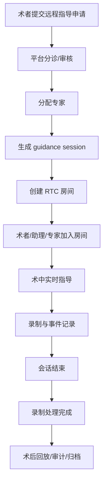

# 手术实时视频远程指导详细设计

## 1. 目标

本设计用于支撑一个新的独立应用：

- 应用名：`remote-guidance`
- 建议目录：`apps/remote-guidance`

该应用承担以下业务目标：

- 医生发起手术远程指导
- 平台分配或邀请专家
- 术中实时音视频协作
- 术中消息、截图、标注、关键时刻记录
- 术后录制回看与审计留痕

同时复用现有能力：

- Supabase 认证
- `profiles` 用户体系
- 医生审核状态
- 后台角色与审计体系

## 2. 与现有系统的衔接

当前仓库里已经有这些可复用基础：

- 用户基础资料：`profiles`
- 医生身份与权限快照：`cn_user_state_snapshots`
- 医生审核与准入：`doctor_applications`、`doctor_audit_logs`
- 后台管理员与审计：`admin_audit_logs`
- 前端认证上下文：`packages/shared/src/context/AuthContext.tsx`

从现有代码看，医生工作台权限已经有明确字段：

- `doctor_privilege_status`
- `permission_flags.can_access_doctor_workspace`

因此远程指导应用不应再自建认证，而应直接建立在现有权限模型上。

## 3. 系统边界

## 3.1 独立应用负责

- 指导会话创建与管理
- 术中实时协作 UI
- 设备接入与房间加入
- 术中事件记录
- 会话回放入口

## 3.2 现有平台继续负责

- 登录认证
- 医生身份审核
- 专家账号管理
- 后台运营与审计
- 用户主档案

## 3.3 RTC 平台负责

- 实时音视频房间
- 弱网自适应
- 录制
- 媒体分发

## 4. 角色设计

建议将远程指导角色定义为：

- `surgeon`
  发起指导的术者
- `assistant`
  手术室助理或配台人员
- `expert`
  远程指导专家
- `observer`
  观摩人员
- `moderator`
  平台运营或医学协调员
- `admin`
  系统管理员

## 4.1 账号侧身份来源

身份建议从现有体系映射：

- 普通认证医生 -> 可成为 `surgeon`
- 已审核通过的专家/讲师/顾问 -> 可成为 `expert`
- 后台管理员 -> 可成为 `admin`
- 经授权观摩人员 -> 可成为 `observer`

## 5. 权限矩阵

| 能力 | surgeon | assistant | expert | observer | moderator | admin |
|---|---|---|---|---|---|---|
| 发起会话申请 | 是 | 否 | 否 | 否 | 否 | 是 |
| 进入房间 | 是 | 是 | 是 | 是 | 是 | 是 |
| 开启本地音频 | 是 | 是 | 是 | 否 | 是 | 是 |
| 开启本地视频 | 是 | 是 | 是 | 否 | 是 | 是 |
| 发送文字消息 | 是 | 是 | 是 | 否 | 是 | 是 |
| 截图 | 是 | 是 | 是 | 否 | 是 | 是 |
| 标注关键时刻 | 是 | 是 | 是 | 否 | 是 | 是 |
| 切换机位 | 是 | 是 | 只读建议 | 否 | 是 | 是 |
| 开始/停止录制 | 否 | 否 | 否 | 否 | 是 | 是 |
| 结束会话 | 是 | 否 | 否 | 否 | 是 | 是 |
| 查看回放 | 受控 | 受控 | 受控 | 否 | 是 | 是 |
| 导出记录 | 否 | 否 | 否 | 否 | 是 | 是 |

说明：

- 录制控制不建议放给医生或专家，避免术中误操作
- `observer` 默认只读，不开麦、不发消息
- 高敏感操作必须审计

## 6. 业务状态机

建议将状态拆成三层：

- 会话状态
- 房间状态
- 录制状态

## 6.1 会话状态

`guidance_sessions.status`

- `draft`
- `requested`
- `triaged`
- `expert_assigned`
- `scheduled`
- `ready`
- `live`
- `paused`
- `ended`
- `archived`
- `cancelled`

### 状态说明

- `draft`
  医生尚未正式提交
- `requested`
  已提交，等待平台处理
- `triaged`
  平台已审核需求并分类
- `expert_assigned`
  已匹配专家
- `scheduled`
  已确定时间
- `ready`
  房间、设备、参与者已准备
- `live`
  会话进行中
- `paused`
  因网络或术中阶段短暂停止
- `ended`
  会话已结束
- `archived`
  已归档，只读
- `cancelled`
  已取消

## 6.2 房间状态

`guidance_rooms.status`

- `provisioning`
- `open`
- `active`
- `closing`
- `closed`
- `failed`

## 6.3 录制状态

`guidance_recordings.status`

- `pending`
- `starting`
- `recording`
- `stopped`
- `processing`
- `ready`
- `failed`
- `expired`

## 7. 核心流程

## 8. 数据模型

以下表建议新增到 Supabase。

## 8.1 `guidance_sessions`

核心会话主表。

关键字段建议：

- `id` uuid pk
- `session_no` text unique
- `site_code` text default `'cn'`
- `title` text
- `session_type` text
  - `live_guidance`
  - `case_discussion`
  - `teaching_demo`
- `status` text
- `priority` text
  - `routine`
  - `urgent`
  - `critical`
- `surgeon_user_id` uuid references `auth.users(id)`
- `assistant_user_id` uuid null
- `requested_expert_user_id` uuid null
- `assigned_expert_user_id` uuid null
- `moderator_user_id` uuid null
- `related_consultation_id` uuid null
- `related_record_id` uuid null
- `related_order_id` uuid null
- `hospital_name` text
- `department_name` text
- `operating_room_name` text
- `patient_species` text
- `patient_identifier` text
- `procedure_name` text
- `clinical_summary` text
- `scheduled_start_at` timestamptz
- `scheduled_end_at` timestamptz
- `actual_started_at` timestamptz
- `actual_ended_at` timestamptz
- `rtc_provider` text
- `rtc_room_name` text
- `rtc_room_sid` text null
- `primary_recording_id` uuid null
- `consent_confirmed` boolean default false
- `confidentiality_level` text default `'restricted'`
- `created_at`
- `updated_at`
- `created_by`

## 8.2 `guidance_participants`

会话参与者表。

关键字段建议：

- `id` uuid pk
- `session_id` uuid references `guidance_sessions(id)`
- `user_id` uuid references `auth.users(id)`
- `participant_role` text
- `invite_status` text
  - `pending`
  - `accepted`
  - `declined`
  - `revoked`
- `join_permission` boolean default true
- `can_publish_audio` boolean
- `can_publish_video` boolean
- `can_send_message` boolean
- `can_annotate` boolean
- `joined_at` timestamptz
- `left_at` timestamptz
- `last_seen_at` timestamptz
- `join_count` integer default 0
- `created_at`

唯一约束：

- `unique(session_id, user_id)`

## 8.3 `guidance_devices`

记录手术室视频源和接入设备。

关键字段建议：

- `id` uuid pk
- `session_id` uuid references `guidance_sessions(id)`
- `device_type` text
  - `mobile_camera`
  - `or_camera`
  - `endoscope_capture`
  - `ultrasound_capture`
  - `vitals_feed`
  - `desktop_share`
- `device_name` text
- `stream_label` text
- `is_primary` boolean default false
- `source_protocol` text
  - `webrtc`
  - `rtmp`
  - `whip`
- `status` text
  - `offline`
  - `ready`
  - `live`
  - `error`
- `connected_at` timestamptz
- `disconnected_at` timestamptz
- `metadata` jsonb
- `created_at`

## 8.4 `guidance_events`

术中所有关键操作都写事件表。

关键字段建议：

- `id` uuid pk
- `session_id` uuid references `guidance_sessions(id)`
- `event_type` text
  - `session_requested`
  - `expert_assigned`
  - `room_opened`
  - `participant_joined`
  - `participant_left`
  - `network_warning`
  - `snapshot_taken`
  - `annotation_added`
  - `recording_started`
  - `recording_stopped`
  - `session_paused`
  - `session_resumed`
  - `session_ended`
- `actor_user_id` uuid null
- `actor_role` text null
- `payload` jsonb
- `event_at` timestamptz default now()

建议索引：

- `idx_guidance_events_session_time`
- `idx_guidance_events_type`

## 8.5 `guidance_recordings`

录制文件与转码结果。

关键字段建议：

- `id` uuid pk
- `session_id` uuid references `guidance_sessions(id)`
- `provider_recording_id` text
- `status` text
- `storage_bucket` text
- `storage_path` text
- `playback_url` text null
- `download_url` text null
- `duration_seconds` integer
- `size_bytes` bigint
- `started_at` timestamptz
- `stopped_at` timestamptz
- `ready_at` timestamptz
- `retention_until` timestamptz
- `checksum` text null
- `metadata` jsonb
- `created_at`

## 8.6 `guidance_annotations`

术中截图、关键时刻、文本标注。

关键字段建议：

- `id` uuid pk
- `session_id` uuid references `guidance_sessions(id)`
- `recording_id` uuid null references `guidance_recordings(id)`
- `annotation_type` text
  - `snapshot`
  - `timeline_marker`
  - `text_note`
  - `risk_flag`
- `author_user_id` uuid
- `author_role` text
- `timestamp_seconds` integer null
- `image_path` text null
- `title` text null
- `content` text null
- `severity` text null
- `metadata` jsonb
- `created_at`

## 8.7 `guidance_expert_availability`

后续如果做排班，这张表很有价值。

关键字段建议：

- `id` uuid pk
- `expert_user_id` uuid references `auth.users(id)`
- `start_at` timestamptz
- `end_at` timestamptz
- `availability_type` text
  - `available`
  - `busy`
  - `on_call`
- `timezone` text
- `notes` text null
- `created_at`

## 8.8 `guidance_access_audits`

专门记录高敏感访问。

关键字段建议：

- `id` uuid pk
- `session_id` uuid references `guidance_sessions(id)`
- `user_id` uuid
- `action` text
  - `view_live`
  - `view_recording`
  - `download_recording`
  - `export_summary`
- `ip_address` text null
- `user_agent` text null
- `created_at`

说明：

- 也可以不单独建表，写入现有 `admin_audit_logs`
- 但业务访问审计建议和后台管理审计分开

## 9. 建议的权限判断逻辑

## 9.1 发起会话

必须满足：

- 已登录
- `doctor_privilege_status = approved`
- `permission_flags.can_access_doctor_workspace = true`

## 9.2 作为专家加入

建议满足任一条件：

- 在 `guidance_participants` 中被明确邀请为 `expert`
- 后台被赋予远程指导专家资格

专家资格建议不要只靠 `is_doctor = true` 判断。

## 9.3 管理员/协调员加入

必须满足：

- `profiles.is_admin = true`
  或
- 在后台角色中拥有远程指导管理权限

## 10. API 设计

建议所有新接口统一挂到：

- `/api/guidance/*`

## 10.1 会话接口

- `POST /api/guidance/sessions`
  创建指导申请
- `GET /api/guidance/sessions`
  查询当前用户相关会话
- `GET /api/guidance/sessions/:id`
  获取会话详情
- `PATCH /api/guidance/sessions/:id`
  更新基础信息
- `POST /api/guidance/sessions/:id/cancel`
  取消会话
- `POST /api/guidance/sessions/:id/end`
  结束会话

## 10.2 参与者接口

- `POST /api/guidance/sessions/:id/participants`
  邀请参与者
- `PATCH /api/guidance/sessions/:id/participants/:participantId`
  更新参与者权限
- `POST /api/guidance/sessions/:id/participants/:participantId/revoke`
  移除参与者

## 10.3 房间与 token 接口

- `POST /api/guidance/sessions/:id/room/open`
  创建或打开 RTC 房间
- `POST /api/guidance/sessions/:id/token`
  生成房间 token
- `POST /api/guidance/sessions/:id/heartbeat`
  上报在线状态

## 10.4 录制接口

- `POST /api/guidance/sessions/:id/recordings/start`
- `POST /api/guidance/sessions/:id/recordings/stop`
- `GET /api/guidance/sessions/:id/recordings`
- `GET /api/guidance/recordings/:id`

## 10.5 标注与事件接口

- `POST /api/guidance/sessions/:id/annotations`
- `GET /api/guidance/sessions/:id/annotations`
- `POST /api/guidance/sessions/:id/events`
- `GET /api/guidance/sessions/:id/events`

## 10.6 后台运营接口

- `POST /api/guidance/admin/sessions/:id/assign-expert`
- `POST /api/guidance/admin/sessions/:id/schedule`
- `POST /api/guidance/admin/sessions/:id/archive`
- `GET /api/guidance/admin/dashboard`

## 11. 页面清单

## 11.1 `apps/remote-guidance`

### 面向医生

- `/guidance`
  我的会话列表
- `/guidance/new`
  发起远程指导
- `/guidance/:id`
  会话详情
- `/guidance/:id/room`
  术中房间页
- `/guidance/:id/review`
  术后回顾页

### 面向专家

- `/expert/guidance`
  待处理/已预约/进行中
- `/expert/guidance/:id`
  专家会话详情
- `/expert/guidance/:id/room`
  专家房间页

### 面向平台协调员

- `/ops/guidance`
  会话总览
- `/ops/guidance/:id`
  分诊/指派/录制/审计

## 11.2 `apps/admin`

建议新增后台模块：

- 远程指导会话管理
- 专家排班
- 录制检索
- 高敏感访问审计

## 12. 房间页 UI 结构

房间页不建议做成通用会议产品样式，而要做成手术指导台。

建议布局：

- 主区域
  术野主画面
- 右侧边栏
  专家视频、次机位、参与者、网络状态
- 底部工具栏
  麦克风、摄像头、截图、标记关键时刻、消息、结束会话
- 侧抽屉
  聊天、事件时间轴、标注列表

## 13. 审计与合规要求

以下操作必须留痕：

- 创建会话
- 指派专家
- 进入直播房间
- 开始/停止录制
- 导出回放
- 下载录制
- 添加标注
- 结束会话

建议最低限度做到：

- 操作人
- 操作时间
- 会话 ID
- IP
- User-Agent
- 操作结果

## 14. 上线阶段建议

## 第一阶段

只做最小闭环：

- 会话申请
- 专家指派
- 单房间实时指导
- 录制
- 回放
- 审计

## 第二阶段

- 多机位
- 时间轴标注
- 排班系统
- 设备接入管理
- 更细角色权限

## 第三阶段

- AI 转写
- AI 摘要
- 风险时刻索引
- 教学示教模式
- 术后质控评分

## 15. 推荐的下一步实施顺序

1. 新增数据库表设计与 migration
2. 新增 `apps/remote-guidance`
3. 接入现有 AuthContext / session
4. 做会话列表与详情页
5. 接入 RTC provider
6. 做房间页 MVP
7. 接入录制与后台检索

## 16. 现在可以立刻进入的开发任务

建议下一轮直接开始做以下两项之一：

### 方案 A：先建表和 API 骨架

适合先把后端域模型稳住。

### 方案 B：先建 `apps/remote-guidance` 应用骨架

适合先把前端独立应用跑起来。

当前更推荐：

- 先建表和 API 骨架
- 再建独立应用

因为这条业务是强状态业务，数据模型先稳定更重要。

